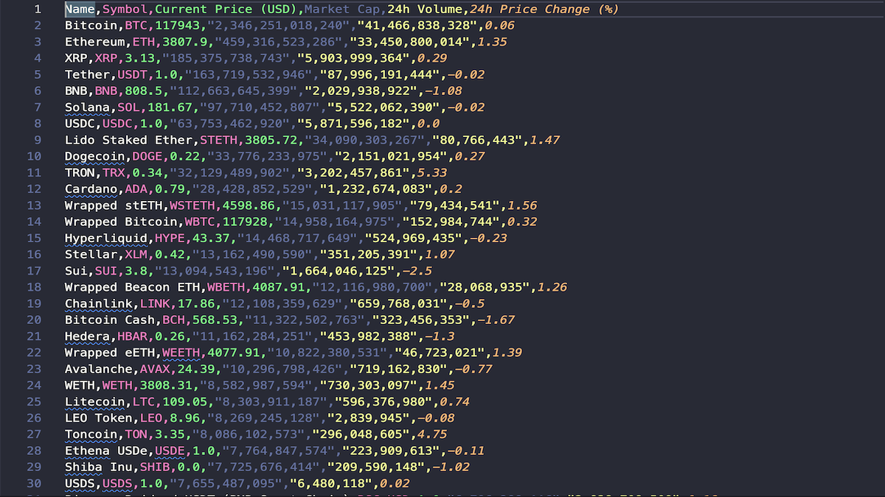

# CoinGecko API Scraper

_Retrieves top cryptocurrencies → structured CSVs with price and market data._


A Python scraper that queries the **CoinGecko public API** for cryptocurrency market data.  
It retrieves the top N coins by market cap, parses the JSON response, and exports clean CSVs for analysis.

---

## 🔍 Key Features

- Retrieves top cryptocurrencies by market cap (default: 100).
- Structured fields exported to CSV: `name`, `symbol`, `current_price`, `market_cap`, `volume_24h`, `price_change_24h_pct`.
- Lightweight (uses Python + requests/httpx).
- Error handling for network failures and API rate limits.
- Easy to extend with custom fields or output formats.

---

## ⚙️ Quick Start

### Prerequisites

- Python **3.10+**
- Git

### Installation

```bash
# 1) Clone
git clone https://github.com/mdugan8186/coingecko-scraper.git
cd coingecko-scraper

# 2) (optional) Virtual environment
python -m venv .venv
# macOS/Linux:
source .venv/bin/activate
# Windows:
.venv\Scripts\activate

# 3) Dependencies
pip install -r requirements.txt
```

### Run

```bash
python main.py
```

- Outputs a CSV at: `output/top_100_crypto_2025-07-29_22-38-18.csv`
- Each run creates a **timestamped CSV** (e.g., `top_100_crypto_2025-07-29_22-38-18.csv`). Older files are not overwritten.

---

## 📁 Output

- **Timestamped CSVs** saved in `output/` (e.g., `top_100_crypto_2025-07-29_22-38-18.csv`).

**Columns**

```
name, symbol, current_price, market_cap, volume_24h, price_change_24h_pct
```

---

## 🎥 Demo

Example of the scraper output:



The full dataset is saved as: [`output/top_100_crypto_2025-07-29_22-38-18.csv`](output/top_100_crypto_2025-07-29_22-38-18.csv)

---

## 🧪 Testing & Dev Notes

See **TESTING.md** for a step-by-step sanity flow, API maintenance notes, and data-quality checks.

---

## 🛠️ Tech Stack

- **Python** (3.10+)
- **requests / httpx** for API calls
- **CSV** outputs (pandas optional for further cleaning)

---

## ⚖️ Legal & Ethical Use

This scraper uses the **CoinGecko public API** and is intended for **educational and demonstration purposes only**.  
Please review and comply with the [CoinGecko API Terms of Service](https://www.coingecko.com/en/api) before using this project beyond small-scale testing or portfolio demonstration.

---

## 📄 License

This project is licensed under the **MIT License**. See [`LICENSE`](./LICENSE).

---

## 👤 About

**Mike Dugan** — Python Web Scraper & Automation Developer

- **GitHub:** [@mdugan8186](https://github.com/mdugan8186)
- **Portfolio Website:** [scraping-portfolio](https://mdugan8186.github.io/scraping-portfolio/)
- **Fiverr:** [Hire Me for a Custom Web Scraper](https://www.fiverr.com/s/99aN6vA)
- **Email:** [mdugan8186.work@gmail.com](mailto:mdugan8186.work@gmail.com)
